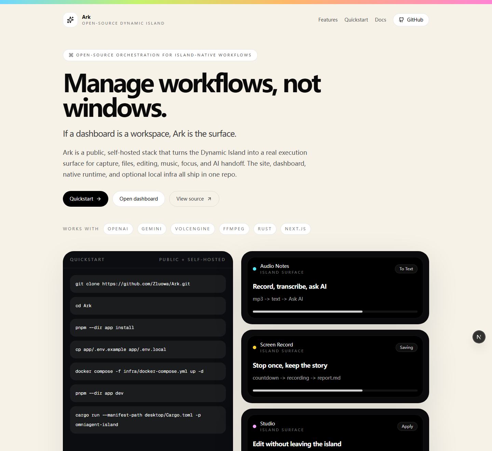
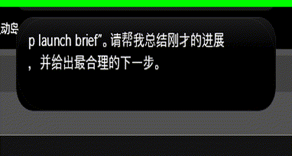

<p align="center">
  
</p>

<p align="center">
  <strong>一句话就完事。</strong>
</p>

<p align="center">
  <strong>Island + Web for people. API for agents.</strong>
</p>

<p align="center">
  <a href="#quickstart"><strong>Quickstart</strong></a>
  &middot;
  <a href="#three-surfaces"><strong>Three Surfaces</strong></a>
  &middot;
  <a href="docs/API_PLATFORM.md"><strong>API Platform</strong></a>
  &middot;
  <a href="docs/SELF_HOSTING.md"><strong>Self Hosting</strong></a>
  &middot;
  <a href="https://github.com/Zluowa/Ark"><strong>GitHub</strong></a>
</p>

<p align="center">
  <a href="LICENSE"></a>
  <a href="https://github.com/Zluowa/Ark/actions/workflows/ci.yml"></a>
  
</p>

<p align="center">
  <sub>We do not hijack attention. We return attention to the user's hands, while Ark's shared backend executes the work.</sub>
</p>

## What is Ark?

Ark is one shared capability layer with three product surfaces:

1. Dynamic Island for lightweight consumer interaction
2. Web for full workflow, files, history, and configuration
3. API for enterprises and agents

The same backend powers all three.

That backend is where Ark's real value lives:
- deterministic execution
- file upload and artifact delivery
- sync and async jobs
- download, conversion, extraction, transcription, and utility work

The user-facing surfaces stay fast and simple. Upstream agents keep reasoning. Ark executes the work.

## Watch the full island tour

<p align="center">
  <a href="app/public/demo/full-island-tour.mp4">
    
  </a>
</p>

<p align="center">
  <sub>Real repo proof media: Audio Notes -> Studio -> NetEase -> Focus.</sub>
</p>

## Three surfaces

| Surface | Audience | Purpose |
| --- | --- | --- |
| Dynamic Island | Consumers | Smallest useful surface for capture, playback, editing, focus, and resume |
| Web workspace | Consumers | Files, history, tool workbench, connections, and deeper control |
| API | Enterprises and agents | Deterministic execution, async jobs, and artifact delivery |
| Shared capability layer | Shared | Tool registry, files, execution runtime, jobs, and artifacts |

Full product positioning lives in [docs/PRODUCT_SURFACES.md](docs/PRODUCT_SURFACES.md).

## Why Ark exists

### For people

Ark keeps the interaction small:
- start from one sentence
- continue from the island when possible
- expand into web only when the workflow needs more room

### For agents and enterprises

Ark keeps execution off the model:
- let the agent handle conversation and reasoning
- send concrete work to Ark
- get files and structured outputs back

This is why Ark is useful for agent products:
- fewer wasted tokens
- fewer custom utilities to rebuild
- faster artifact delivery
- one backend contract behind many tools

API platform notes live in [docs/API_PLATFORM.md](docs/API_PLATFORM.md).

## Current product truth

Ark already ships:
- island-native audio capture, screen capture, Studio edits, playback, focus, and file resume
- a public website and dashboard
- API routes for platform discovery, tool registry, file upload, sync execution, async execution, and job polling
- one-step local video subtitle generation for uploaded video files
- remote subtitle extraction for real Bilibili, YouTube, Douyin, and direct downloadable video URLs
- a local `managed_ark_key` service mode that lets platform operators issue, inspect, rotate, and revoke tenant-facing Ark keys

Ark does **not** currently claim:
- a universal video subtitle extractor
- every future 100+ tool already live today

Current subtitle and transcription boundary is documented honestly in [docs/VIDEO_SUBTITLE_CAPABILITY.md](docs/VIDEO_SUBTITLE_CAPABILITY.md).

## Quickstart

Open source. Self-hosted. BYOK today.

```bash
pnpm onboard --yes --profile full
```

Checklist only:

```bash
pnpm onboard --dry-run --profile full
```

Manual path:

```bash
git clone https://github.com/Zluowa/Ark.git
cd Ark
pnpm --dir app install
cp app/.env.example app/.env.local
docker compose -f infra/docker-compose.yml up -d
pnpm --dir app dev
cargo run --manifest-path desktop/Cargo.toml -p omniagent-island
```

Detailed self-hosting:
- [docs/SELF_HOSTING.md](docs/SELF_HOSTING.md)
- [docs/AGENT_DEPLOYMENT.md](docs/AGENT_DEPLOYMENT.md)
- [docs/LOCAL_AGENT_SERVER.md](docs/LOCAL_AGENT_SERVER.md)
- [docs/MCP_SERVER.md](docs/MCP_SERVER.md)

## API quickstart

Public discovery:

```bash
curl -s http://127.0.0.1:3010/api/v1/platform
curl -s http://127.0.0.1:3010/api/v1/tools/registry
```

Sync execution:

```bash
curl -X POST http://127.0.0.1:3010/api/v1/execute \
  -H "X-API-Key: $ARK_API_KEY" \
  -H "Content-Type: application/json" \
  -d '{"tool":"pdf.compress","params":{"file_url":"https://example.com/input.pdf"}}'
```

Async execution:

```bash
curl -X POST http://127.0.0.1:3010/api/v1/execute/async \
  -H "X-API-Key: $ARK_API_KEY" \
  -H "Content-Type: application/json" \
  -d '{"tool":"media.download_video","params":{"url":"https://www.bilibili.com/video/BV..."}}'
```

Today, in open-source mode:
- operators bring provider keys
- operators issue bootstrap deployment API keys
- operators can mint and revoke scoped agent keys through `/api/v1/admin/api-keys`
- operators can provision tenants and receive tenant bootstrap keys through `/api/v1/admin/tenants`
- tenant bootstrap keys can mint tenant-scoped runtime keys without platform-wide admin

Also available in this repo:
- `OMNIAGENT_SERVICE_MODE=managed_ark_key`
- `POST /api/v1/admin/managed-tenants`
- `GET /api/v1/admin/managed-tenants`
- `GET /api/v1/admin/managed-tenants/{tenantId}`
- `PATCH /api/v1/admin/managed-tenants/{tenantId}`
- `POST /api/v1/admin/managed-tenants/{tenantId}/keys`
- `DELETE /api/v1/admin/managed-tenants/{tenantId}/keys/{keyId}`
- platform operators can issue tenant-facing Ark keys without sending provider keys in the client request
- platform operators can inspect tenant usage and recent execution records through the managed control plane
- the managed mode still runs on your own infrastructure; SaaS billing and hosted multitenancy are separate future layers

## Docs map

- Product surfaces: [docs/PRODUCT_SURFACES.md](docs/PRODUCT_SURFACES.md)
- API platform: [docs/API_PLATFORM.md](docs/API_PLATFORM.md)
- Video subtitle boundary: [docs/VIDEO_SUBTITLE_CAPABILITY.md](docs/VIDEO_SUBTITLE_CAPABILITY.md)
- MCP server: [docs/MCP_SERVER.md](docs/MCP_SERVER.md)
- Self hosting: [docs/SELF_HOSTING.md](docs/SELF_HOSTING.md)
- Agent deployment: [docs/AGENT_DEPLOYMENT.md](docs/AGENT_DEPLOYMENT.md)
- Local agent server: [docs/LOCAL_AGENT_SERVER.md](docs/LOCAL_AGENT_SERVER.md)
- TypeScript SDK: [sdk/typescript/README.md](sdk/typescript/README.md)
- Python SDK: [sdk/python/README.md](sdk/python/README.md)

## Development

```bash
pnpm --dir app typecheck
pnpm --dir app build
pnpm --dir app smoke:video-subtitle
pnpm sdk:build:ts
pnpm mcp:smoke
pnpm local:server:smoke
cargo test --manifest-path desktop/Cargo.toml -p omniagent-island -j 1
node scripts/check-task-delivery.mjs
node scripts/check-task-delivery.mjs --require-ui
```

## FAQ

### Is Ark only for agents?

No. Dynamic Island and Web are for people. The API is for enterprises and agents. All three use the same backend layer.

### Does the public repo already ship a hosted Ark key?

Partially. The repo now ships a local `managed_ark_key` service mode for operator-managed deployments, including tenant issuance, managed-tenant inspection, usage visibility, and tenant-key rotation/revocation. It is not a hosted Ark SaaS billing/control-plane product yet.

### Can one self-hosted Ark deployment serve multiple agent teams?

Yes. The public repo now includes a local tenant control plane:
- platform operators can create tenants with default quota policy
- tenant creation returns a tenant bootstrap key
- tenant bootstrap keys can mint and revoke their own runtime keys
- suspended tenants immediately lose API access

### Is Ark only a UI project?

No. The UI surfaces are important, but the core product is the shared execution layer underneath them.

### Does Ark already support universal video subtitle extraction?

Partially. Ark now supports:
- one-step local uploaded video to `transcript + txt + srt + vtt`
- real Bilibili, YouTube, Douyin, and direct-download link subtitle extraction through `media.extract_subtitle`
- Xiaohongshu through the same tool path when the deployment has a tenant XHS connection or `OMNIAGENT_XHS_COOKIE`

It is still not a universal arbitrary-link subtitle product yet. The remaining boundary is documented in [docs/VIDEO_SUBTITLE_CAPABILITY.md](docs/VIDEO_SUBTITLE_CAPABILITY.md).

## Contributing

See [CONTRIBUTING.md](CONTRIBUTING.md).

## Security

See [SECURITY.md](SECURITY.md).

## License

MIT
